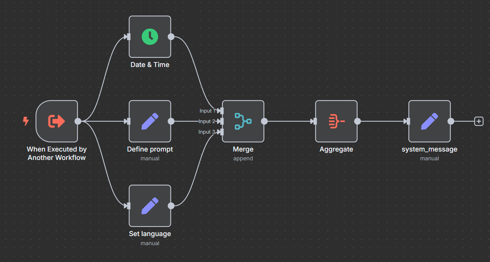
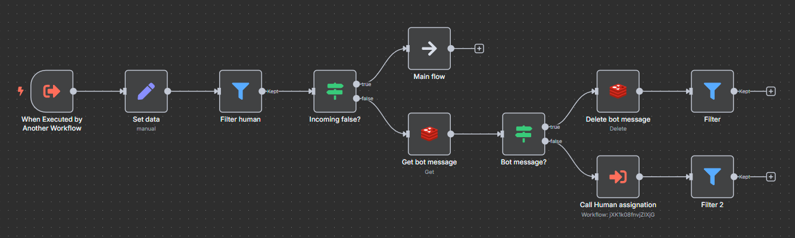
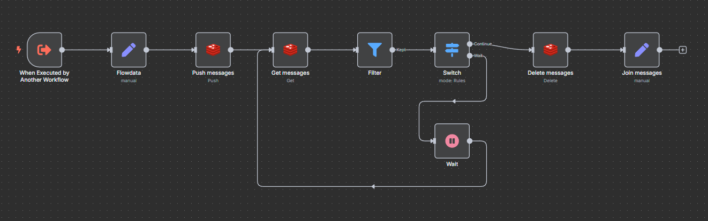
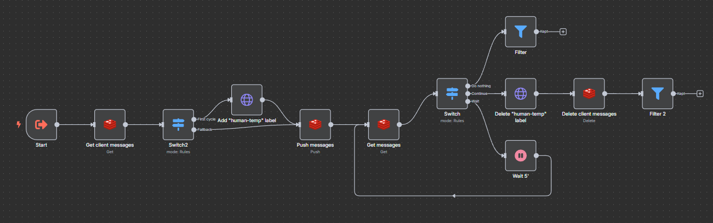
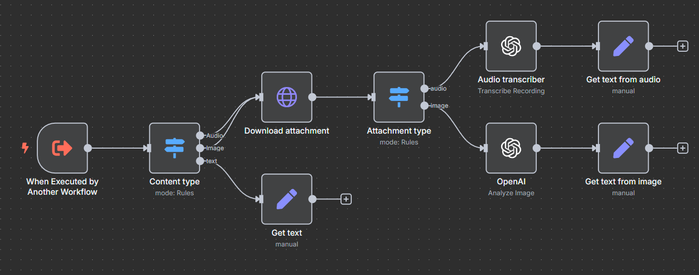
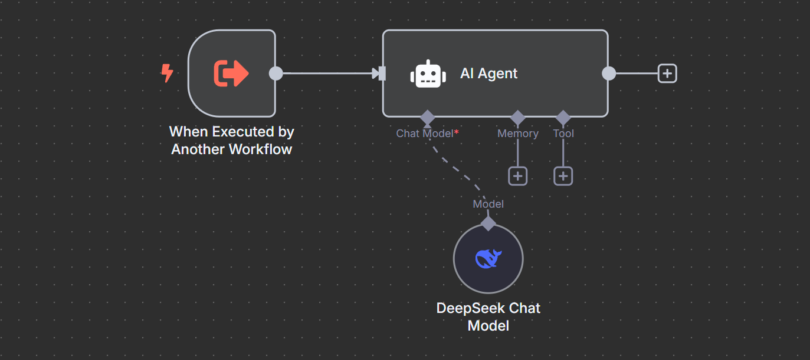
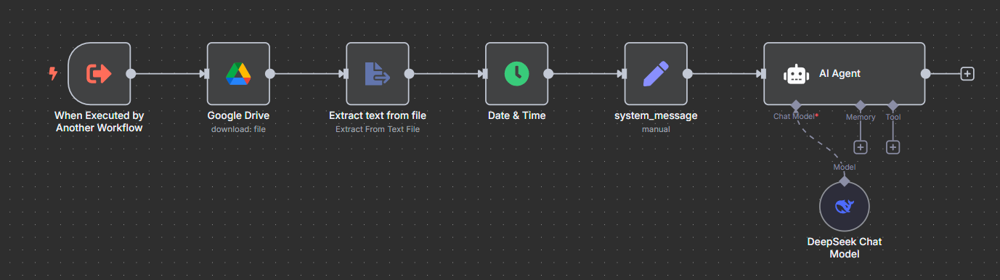

# n8n Workflows Library

A curated collection of reusable **n8n sub-workflows** I use to build modular, AI-enabled automations.  
This library serves as both a personal toolkit and a portfolio of how I design scalable automation logic.

---

## Sub-Workflows

### 🧠 build-system-message

Prepares the system message for the main AI agent. Adds:

- Current date
- Detected language
- A configurable base prompt

---

### 🔥 firewall

Filters messages that:

- Are marked as `"human": true`
- Are already outgoing (to avoid loops)

Useful as a **firewall** to stop bot logic when a human agent is in control.

> Requires: **Redis**

---

### 🧱 message-buffer

Buffers user input to wait for several partial messages.
Merges them into one message before triggering the main flow.

> Requires: **Redis**

---

### 👤 human-pause

Handles human handoff using Chatwoot. When a message is flagged as human-intended:

- Tags the conversation with `human-temp`
- Pauses bot interaction for 15 minutes
- Resumes once the tag is removed

> Requires: **Redis**, **Chatwoot**

---

### 🎙️ transcribe-media

Converts audio or video messages into text using OpenAI's transcription tools.

> Requires: **LLM API**

---

### 🌍 detect-language-agent

Detects the user's language for downstream use.  
Includes a system message (`system-message.md`) to define how to handle ambiguous input.

---

## 🛠 Agent Tools

These are tools used **within AI agents**, not standalone workflows.  
They’re embedded in tool definitions, and help the main agent delegate tasks intelligently.

---

### 🧑‍🏫 ai-subagent-google-doc

A specialized sub-agent (tool) used by the main AI agent to answer questions about a specific topic.  
The tool builds its system message using a document stored in **Google Drive**.

Key features:

- The main agent calls it when a topic-specific question is detected
- The prompt is fully sourced from a shared Google Doc
- Ideal for FAQs, technical instructions, or policies managed by the client

> Requires: **Google Drive API access**, **LLM API**

---

## 🚀 How to Use

These are **sub-workflows**, designed to be used with the **Execute Workflow** node inside larger n8n workflows.

To import and use:

1. Download the `.json` file
2. Go to **Workflows > Import** in your n8n instance
3. In your main workflow, use an **Execute Workflow** node to call the sub-workflow as a module

> Use tags or naming conventions in n8n to track which main workflows use which sub-modules.

---

## 🙋‍♂️ About Me

I use n8n to build AI-driven automations, mostly around chatbots, customer service, and human-agent coordination (via Chatwoot, WhatsApp, OpenAI, etc).
This repo helps me reuse and share the logic I use the most.

Feel free to explore, adapt, and reach out if you'd like to collaborate.
