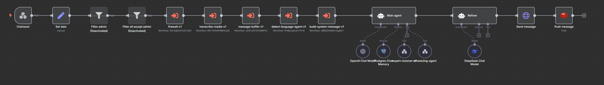

# n8n Workflows Library

A curated collection of reusable **n8n sub-workflows** I use to build modular, AI-enabled automations.  
This library serves as both a personal toolkit and a portfolio of how I design scalable automation logic.

---

## 🤖 Main AI Agents

These are complete AI assistants, built by combining multiple sub-workflows and tools.  
They are connected to external platforms (like Chatwoot) and serve as the main logic layer for automating conversations.

---

### 🏢 business-assistant

This is a full AI assistant designed to support small-to-medium businesses via platforms like **Chatwoot**.  
It integrates several reusable sub-workflows (firewall, memory buffer, human assignment, etc.) and tools (e.g. AI sub-agents).

Key features:

- Handles customer support, FAQs, and product queries
- Delegates to human agents when needed
- Loads context from language detection, date, and a shared prompt
- Modular design: easily adaptable per client

> Requires: Redis, Chatwoot, LLMs

---

## Sub-Workflows

### 🧠 build-system-message

Prepares the system message for the main AI agent. Adds:

- Current date
- Detected language
- A configurable base prompt

---

### 🔥 firewall

Filters messages that:

- Are marked as `"human": true`
- Are already outgoing (to avoid loops)

Useful as a **firewall** to stop bot logic when a human agent is in control.

> Requires: **Redis**

---

### 🧱 message-buffer

Buffers user input to wait for several partial messages.
Merges them into one message before triggering the main flow.

> Requires: **Redis**

---

### 👤 human-pause

Handles human handoff using Chatwoot. When a message is flagged as human-intended:

- Tags the conversation with `human-pause`
- Pauses bot interaction for 15 minutes
- Resumes once the tag is removed

> Requires: **Redis**, **Chatwoot**

---

### 🎙️ transcribe-media

Converts audio or video messages into text using OpenAI's transcription tools.

> Requires: **LLM API**

---

### 🌍 detect-language-agent

Detects the user's language for downstream use.

---

### 🗓️ calendar-operations

Internal workflow responsible for executing calendar operations in Google Calendar. It checks availability, creates events, cancels appointments, and suggests alternatives when needed. It does not interact with users directly and only responds to structured queries from the main agent.

> Requires: **Google Calendar**, **LLM API**

---

## 🛠 Agent Tools

These are tools used **within AI agents**, not standalone workflows.  
They’re embedded in tool definitions, and help the main agent delegate tasks intelligently.

---

### 🧑‍🏫 expert-resolver

A specialized sub-agent (tool) used by the main AI agent to answer questions about a specific topic.  
The tool builds its system message using a **Google Docs** document.

Key features:

- The main agent calls it when a topic-specific question is detected
- The prompt is fully sourced from a shared Google Doc
- Ideal for FAQs, technical instructions, or policies managed by the client

> Requires: **Google Docs API access**, **LLM API**

---

### 🤖 scheduling-agent

Workflow that manages user appointment requests. It processes natural language inputs, detects scheduling intents (create, modify, or cancel), and delegates calendar actions to the internal calendar-operations tool.

> Requires: **Google Calendar**, **LLM API**

---

## 🙋‍♂️ About Me

I use n8n to build AI-driven automations, mostly around chatbots, customer service, and human-agent coordination (via Chatwoot, WhatsApp, OpenAI, etc).
This repo helps me reuse and share the logic I use the most.

Feel free to explore, adapt, and reach out if you'd like to collaborate.
